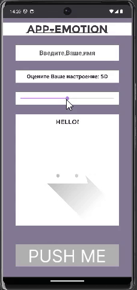
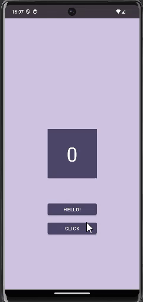
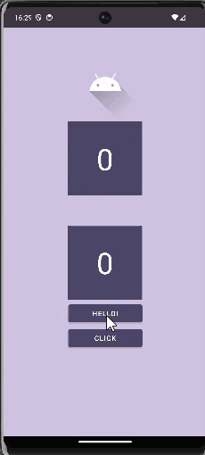
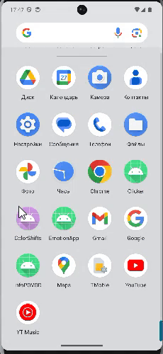
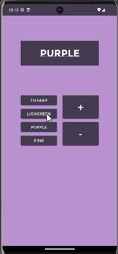
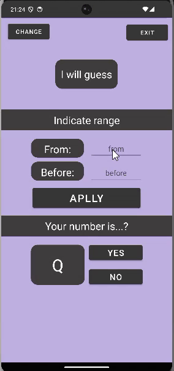
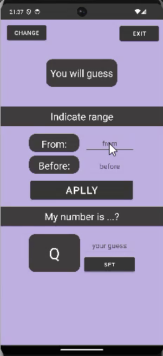
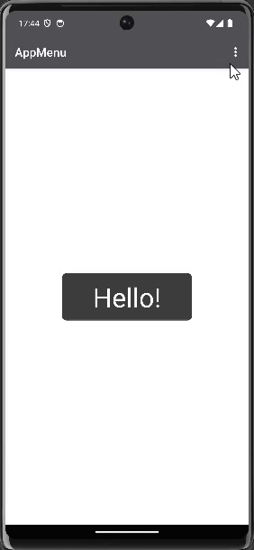
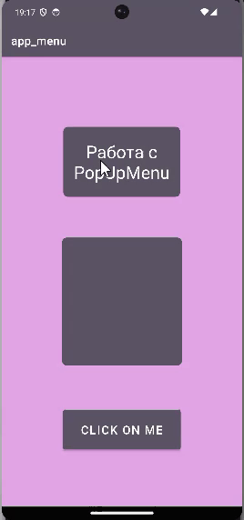
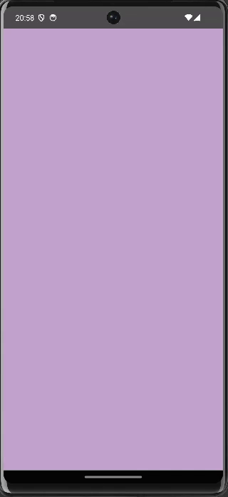

# 📱 Android Labs - Программирование мобильных устройств

<div align="center">


**Учебные лабораторные работы по курсу "Программирование мобильных устройств"**

</div>

## 📚 Описание

Коллекция лабораторных работ по изучению Android разработки. Каждая лаба демонстрирует различные аспекты создания мобильных приложений - от базовых компонентов до сложных архитектурных решений.

## 🎬 Демонстрация работ

<div align="center">

### Демонстрация
| Демо 1 | Демо 2 | Демо 3 | Демо 4 |
|:---:|:---:|:---:|:---:|
|  |  |  |  |

### Демонстрация
| Демо 5 | Демо 6 | Демо 7 | Демо 8 |
|:---:|:---:|:---:|:---:|
|  |  |  |  |

### Демонстрация
| Демо 9 | Демо 10 | Демо 11 |
|:---:|:---:|:---:|
|  |  |  |

</div>

## 🛠️ Технологии

- **Kotlin** - основной язык разработки
- **Android SDK** - фреймворк для мобильной разработки  
- **Android Studio** - IDE для разработки
- **XML** - верстка интерфейсов

## 📋 Структура проекта

```
android_labs/
├── demo/               # GIF демонстрации приложений
├── ActivityWork/       # Работа с Activities
├── ActivityWork_2/     # Продвинутые Activities
├── AnInd/              # UI компоненты
├── app_menu/           # Меню приложений
├── AppAnimation/       # Анимации
├── AppForL3/           # Лабораторная работа #3
├── AppMenu/            # Системы меню
├── ColorShifts/        # Работа с цветами
├── EmotionApp/         # Эмоциональные интерфейсы
└── MyApplication/      # Базовое приложение
```

---

<div align="center">

**📚 Учебный проект УрТИСИ СибГУТИ**  
*Курс: Программирование мобильных устройств*

</div>